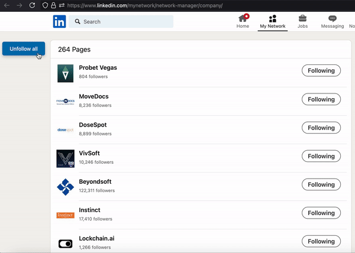

# LinkedIn Auto Unfollow Companies

This userscript adds a floating "Unfollow all" button to LinkedIn's company network manager page. When clicked, it automatically unfollows all the companies you are currently following.

## Installation

1. **Install a Userscript Manager:**
   - Google Chrome: Install [Tampermonkey](https://chromewebstore.google.com/detail/tampermonkey/dhdgffkkebhmkfjojejmpbldmpobfkfo).
   - Mozilla Firefox: Install [Greasemonkey](https://addons.mozilla.org/en-US/firefox/addon/greasemonkey/).
2. **Install the Userscript:**
   - Click on this [direct link to the script](https://github.com/rzagreb/linkedin-auto-unfollow-companies-userscript/raw/main/linkedin-auto-unfollow-companies.user.js).
   - Your userscript manager should prompt you to install the script.
   - Confirm the installation.

## Usage

1. **Navigate to the LinkedIn Company Network Manager**
   - Go to [LinkedIn Company Network Manager](https://www.linkedin.com/mynetwork/network-manager/company/).

2. **Use the Floating "Unfollow all" Button**
   - A floating button labeled **"Unfollow all"** will appear on the left side of the page.
   - Click the button to start unfollowing all companies.

3. **Monitor the Process (for nerds)**
   - Open your browser's console to view detailed logs.
     - **Chrome**: Press `Ctrl+Shift+J` (Windows) or `Cmd+Option+J` (Mac).
     - **Firefox**: Press `Ctrl+Shift+K` (Windows) or `Cmd+Option+K` (Mac).
   - The script will automatically scroll through the page and unfollow each company.

